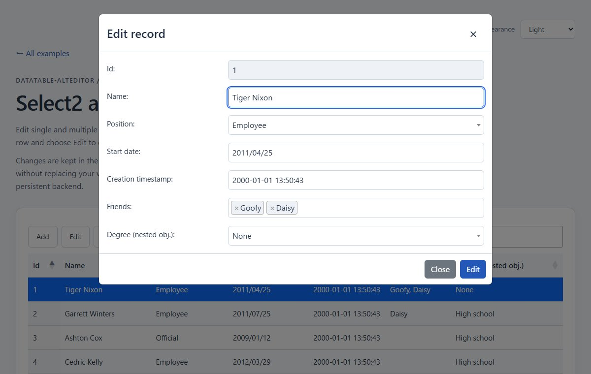
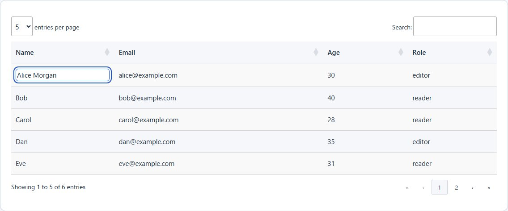

# DataTables AltEditor

[](LICENSE)
[](https://github.com/bensitu/DataTable-AltEditor/actions/workflows/test.yml)
[](https://bensitu.github.io/DataTable-AltEditor/)

Add row dialogs and cell editing to DataTables 2.x. AltEditor supports array and object data, nested fields, validation, asynchronous saves, custom dialog templates, translations, and light and dark themes.

**[Try the live examples](https://bensitu.github.io/DataTable-AltEditor/)** · [Documentation](docs/README.md) · [Changelog](CHANGELOG.md) · [Contributing](CONTRIBUTING.md)

## See it in action

[](https://bensitu.github.io/DataTable-AltEditor/example/06_select_datepicker/example6.html)

Row editing with Select2 and date fields. [Open this example](https://bensitu.github.io/DataTable-AltEditor/example/06_select_datepicker/example6.html).

<details>
<summary>Preview inline editing</summary>

[](https://bensitu.github.io/DataTable-AltEditor/example/13_inline_edit/example13.html)

Double-click a cell, then save with Enter or cancel with Escape. [Try keyboard navigation and failed-save recovery](https://bensitu.github.io/DataTable-AltEditor/example/13_inline_edit/example13.html).

</details>

Screenshots show the included examples; table and page styling belongs to the examples. AltEditor styles remain scoped to its own controls and dialogs.

## Requirements

- DataTables `>=2.1.0 <3` and jQuery `>=1.8 <5`. Examples use DataTables 2.3.8 and jQuery 3.7.1; choose versions supported by your optional plugins.
- For row dialogs: Bootstrap 5, Bootstrap 4, or Foundation Reveal 6. Bootstrap 3 compatibility is best effort. Optional native dialogs are available through `dialog.framework: 'native'`; see [dialog configuration](docs/dialogs.md#framework-selection-and-browser-compatibility).
- For toolbar actions: DataTables Buttons and Select. Programmatic methods accept explicit row selectors without these extensions.
- Inline editing uses native controls and does not require a dialog framework.
- Use a current browser supported by DataTables 2.x. Internet Explorer is unsupported. ES2015 source syntax does not imply support for older CSS engines; see [styling requirements](docs/styling.md).

## Get started

Download a [GitHub release](https://github.com/bensitu/DataTable-AltEditor/releases) or clone the repository and copy the tracked `dist/` files into your application. This project is distributed through GitHub; there are currently no plans to publish it to the npm registry. Node.js is only needed for development and building local archives.

Load jQuery, DataTables, and your dialog framework before AltEditor. Load the editor stylesheet after the framework stylesheet:

```html
<link rel="stylesheet" href="dist/dataTables.altEditor.min.css" />
<script src="dist/dataTables.altEditor.min.js"></script>

<table id="people"></table>
```

```js
const table = new DataTable('#people', {
  data: [{ id: 'alice', name: 'Alice', age: 30 }],
  rowId: 'id',
  columns: [
    { data: 'name', title: 'Name', required: true },
    { data: 'age', title: 'Age', type: 'number', min: 0 },
  ],
  altEditor: { inlineEdit: true },
});

table.altEditor().openEditDialog('#alice');
```

Run this script after the table element and dependencies have loaded. This example opens a row dialog and also enables double-click cell editing. For dialogs only, use `altEditor: true`. Without persistence callbacks, changes are kept in the current table and disappear when data reloads.

Both `new DataTable()` and jQuery initialization work. To add toolbar buttons, load Buttons and Select and add these DataTable options:

```js
const toolbarOptions = {
  select: 'single',
  layout: {
    topStart: {
      buttons: [
        { name: 'add', text: 'Add' },
        { name: 'edit', text: 'Edit' },
        { name: 'delete', text: 'Delete' },
      ],
    },
  },
};
```

Pass these options together with `data`, `columns`, and `altEditor` when constructing the table. [Example 2](https://bensitu.github.io/DataTable-AltEditor/example/02_in_memory_objects/example2.html) includes the complete page and script.

For server persistence, configure `onAddRow`, `onEditRow`, and `onDeleteRow`. Call `success(persistedRow)` or `error(errorValue)` when your request finishes. Stable `rowId` values preserve update targets across reloads. See the [callback contract and PATCH example](docs/api.md#persistence-callbacks); server-side validation and authorization remain application responsibilities.

## Customize dialogs

Use `altEditor.dialog.templates.add` and `.edit` for independent form layouts. Generated fields keep their validation and save behavior. Configure `dialog.deleteDetails` to display selected records, and use lifecycle callbacks to initialize custom presentation. See the [dialog guide](docs/dialogs.md) and [complete template example](example/18_dialog_templates/example18.html). Existing configurations need no changes.

## Choose an example

**[Browse all live examples](https://bensitu.github.io/DataTable-AltEditor/)** or open a specific feature below. Start with Example 02 for object-based row dialogs, Example 03 for persistence callbacks, or Example 13 for cell editing. The [example guide](docs/examples.md) maps integration needs to demos, links to each configuration file, and explains how to adapt the simulated operations.

| No. | Feature                      | Live demo                                                                                                     | Code                                        |
| --- | ---------------------------- | ------------------------------------------------------------------------------------------------------------- | ------------------------------------------- |
| 01  | Array rows                   | [Open example](https://bensitu.github.io/DataTable-AltEditor/example/01_in_memory_arrays/example1.html)       | [Source](example/01_in_memory_arrays/)      |
| 02  | Object rows                  | [Open example](https://bensitu.github.io/DataTable-AltEditor/example/02_in_memory_objects/example2.html)      | [Source](example/02_in_memory_objects/)     |
| 03  | Ajax persistence             | [Open example](https://bensitu.github.io/DataTable-AltEditor/example/03_ajax_objects/example3.html)           | [Source](example/03_ajax_objects/)          |
| 04  | Field options                | [Open example](https://bensitu.github.io/DataTable-AltEditor/example/04_more/DataTableExample.html)           | [Source](example/04_more/)                  |
| 05  | Multiple tables              | [Open example](https://bensitu.github.io/DataTable-AltEditor/example/05_two_datatables/example5.html)         | [Source](example/05_two_datatables/)        |
| 06  | Select2 and date pickers     | [Open example](https://bensitu.github.io/DataTable-AltEditor/example/06_select_datepicker/example6.html)      | [Source](example/06_select_datepicker/)     |
| 07  | Dependent selects            | [Open example](https://bensitu.github.io/DataTable-AltEditor/example/07_dependent_select/example7.html)       | [Source](example/07_dependent_select/)      |
| 08  | Validation                   | [Open example](https://bensitu.github.io/DataTable-AltEditor/example/08_validation/example8.html)             | [Source](example/08_validation/)            |
| 09  | Translations                 | [Open example](https://bensitu.github.io/DataTable-AltEditor/example/09_translations/example9.html)           | [Source](example/09_translations/)          |
| 10  | File attachments             | [Open example](https://bensitu.github.io/DataTable-AltEditor/example/10_file_upload/example10.html)           | [Source](example/10_file_upload/)           |
| 11  | Foundation dialogs           | [Open example](https://bensitu.github.io/DataTable-AltEditor/example/11_foundation/example11.html)            | [Source](example/11_foundation/)            |
| 12  | Custom action buttons        | [Open example](https://bensitu.github.io/DataTable-AltEditor/example/12_custom_action_buttons/example12.html) | [Source](example/12_custom_action_buttons/) |
| 13  | Cell inline editing          | [Open example](https://bensitu.github.io/DataTable-AltEditor/example/13_inline_edit/example13.html)           | [Source](example/13_inline_edit/)           |
| 14  | Rendered controls            | [Open example](https://bensitu.github.io/DataTable-AltEditor/example/14_rendered_controls/example14.html)     | [Source](example/14_rendered_controls/)     |
| 15  | Multiple-row deletion        | [Open example](https://bensitu.github.io/DataTable-AltEditor/example/15_bulk_delete/example15.html)           | [Source](example/15_bulk_delete/)           |
| 16  | Server persistence and files | [Open example](https://bensitu.github.io/DataTable-AltEditor/example/16_server_files/example16.html)          | [Source](example/16_server_files/)          |
| 17  | Advanced inline editing      | [Open example](https://bensitu.github.io/DataTable-AltEditor/example/17_inline_options/example17.html)        | [Source](example/17_inline_options/)        |
| 18  | Custom dialog templates      | [Open example](https://bensitu.github.io/DataTable-AltEditor/example/18_dialog_templates/example18.html)      | [Source](example/18_dialog_templates/)      |
| 19  | Optional native dialogs      | [Open example](https://bensitu.github.io/DataTable-AltEditor/example/19_native_dialog/example19.html)         | [Source](example/19_native_dialog/)         |

Examples 03, 05, 06, 07, and 10 use static Ajax responses. Example 16 includes a [local Node.js server](example/16_server_files/README.md) for real persistence and file uploads; GitHub Pages only shows its setup instructions. Refresh restores the static examples' original data. The Appearance selector provides system, light, and dark modes. Examples require internet access for CDN dependencies.

## Find the documentation

| I want to…                                            | Read                                          |
| ----------------------------------------------------- | --------------------------------------------- |
| Configure fields, callbacks, files, or public methods | [Configuration and API](docs/api.md)          |
| Enable cell editing and keyboard navigation           | [Inline editing](docs/inline-edit.md)         |
| React to saves, errors, and dialog lifecycle          | [Events](docs/events.md)                      |
| Override styles or enable dark mode                   | [Styling and themes](docs/styling.md)         |
| Translate labels and messages                         | [Translations](docs/translations.md)          |
| Upgrade an existing v3 integration                    | [Migration guide](docs/migration-v3-to-v4.md) |
| Diagnose common integration problems                  | [Troubleshooting](docs/troubleshooting.md)    |
| Build, test, or submit a change                       | [Contributing](CONTRIBUTING.md)               |
| Deploy examples or prepare a GitHub release           | [Publishing](docs/publishing.md)              |

Readable and minified UMD files are available with source maps. AMD consumers map `jquery` and `datatables.net`; CommonJS usage is described in [Configuration and API](docs/api.md#module-loading).

## Contributing and support

Include a small reproduction with synthetic data when reporting a bug. Pull requests should describe the change and relevant verification; see [CONTRIBUTING.md](CONTRIBUTING.md).

Follow the [Code of Conduct](CODE_OF_CONDUCT.md). Report security concerns through the [Security Policy](SECURITY.md), keeping vulnerability details out of public issues.

## Buy Me A Coffee

If AltEditor helps your work, you can support its maintenance.

<a href="https://www.buymeacoffee.com/bensitu" rel="nofollow">
  
</a>

## License

MIT. See [LICENSE](LICENSE) for terms and contributor attribution, and [CHANGELOG.md](CHANGELOG.md) for release history.
